# NikeClone

#### {03/29/19} initial start  // {04/05/19} continuation

### Created by: Robbie Kruszynski

## Description
https://www.nike.com/ clone using Angular

This project was generated with [Angular CLI](https://github.com/angular/angular-cli) version 1.6.5.

## Research
* Study of https://www.nike.com/
* Understanding where the separation of presented information rests.
* Pinpointing if flex is used over grid methods in CSS
* Observing the order of photos and aesthetic value for layout

### Setup/Installation Requirements
* As of 04/05/19:
* Open your preferred browser
* copy / paste
* https://github.com/Robbiekruszynski/Angular-Nike-
* Make sure you're in your Desktop directory
* clone or download the following .git https://github.com/Robbiekruszynski/Angular-Nike-.git
* Open your terminal and navigate to the nike-clone directory
(cd desktop --cd nike-clone)
* Once in your terminal and proper directory run the command
`npm install` (provided you are free of errors continue and run the next command)
* `npm ng serve -open` (should automatically open in your default browser)
*  This will result in running on a local host

### Setup/Installation Requirements for Live Deployment
* You will need to create an api file
`touch src/app/api-keys.ts`
* You are required you to have a firebase project setup so please go to https://www.firebase.com and signin with your google account then select Console in the top right corner
* Create a new project. Your project name should align with the overall project. Name it angular-nike.
* Open Angular-nike folder in your text editor.
* Locate the api-keys.ts file that we created in the project
* Inside this file add this line
`export const masterFirebaseConfig = { apiKey: "xxxx", authDomain: "xxxx.firebaseapp.com", databaseURL: "https://xxxx.firebaseio.com", storageBucket: "xxxx.appspot.com", messagingSenderId: "xxxx" };`

* Navigate to https://www.firebase.com and click on Go To Console in the top right corner. Select the project we just created. In Project overview you should see a symbol that looks like this </> click it and that showcase in the info you need
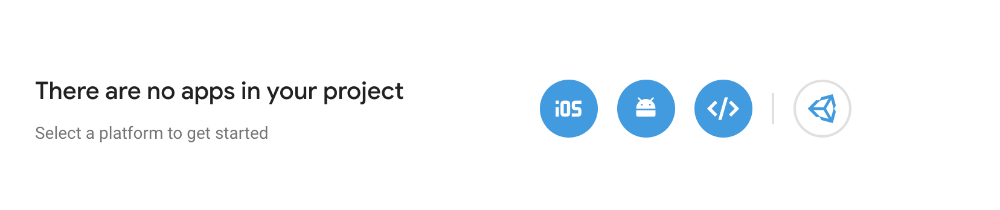
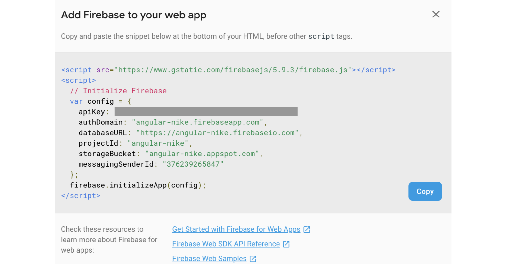

* In your api-keys.ts file replace all the x with the information that firebase gave you.
* You may run npm start of ng serve --open to bring up a live version of the website through your local host
* Make sure you view the rules under Database and they are set to true in order to run and edit the live version hosted on firebase.
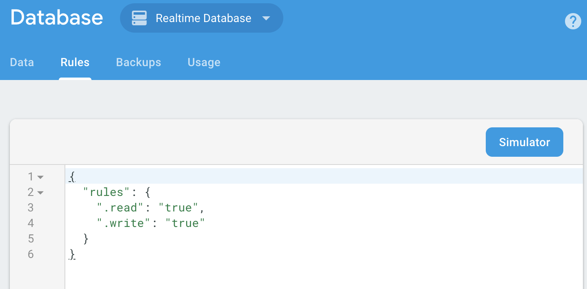
* go in your terminal and run firebase deploy
*  copy and paste the link proved in your browser to view the live version

## Specs
* User will have the ability to explore the Nike clone and compare it to the original design
* User will have the ability to click on the search button to generate shoes from firebase database.

## Development server

Run `ng serve` for a dev server. Navigate to `http://localhost:4200/`. The app will automatically reload if you change any of the source files.

## Screenshots
#### Original site:
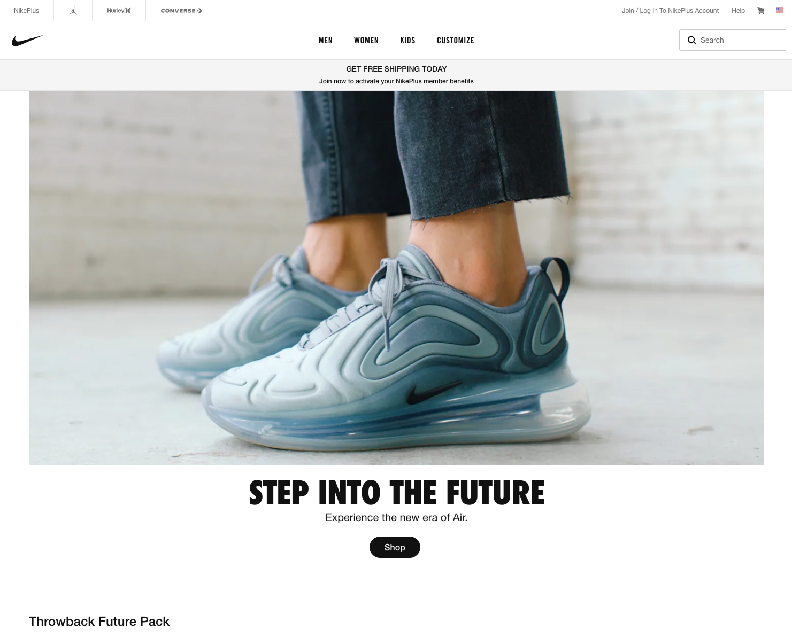
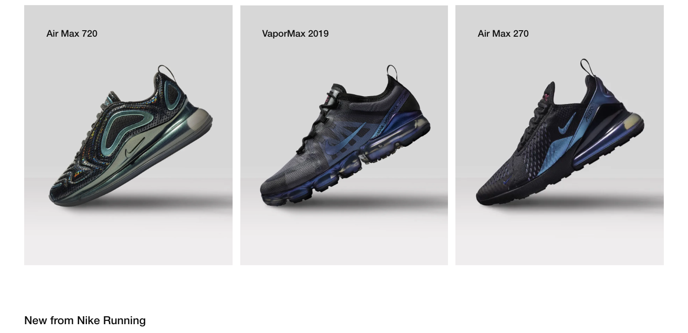

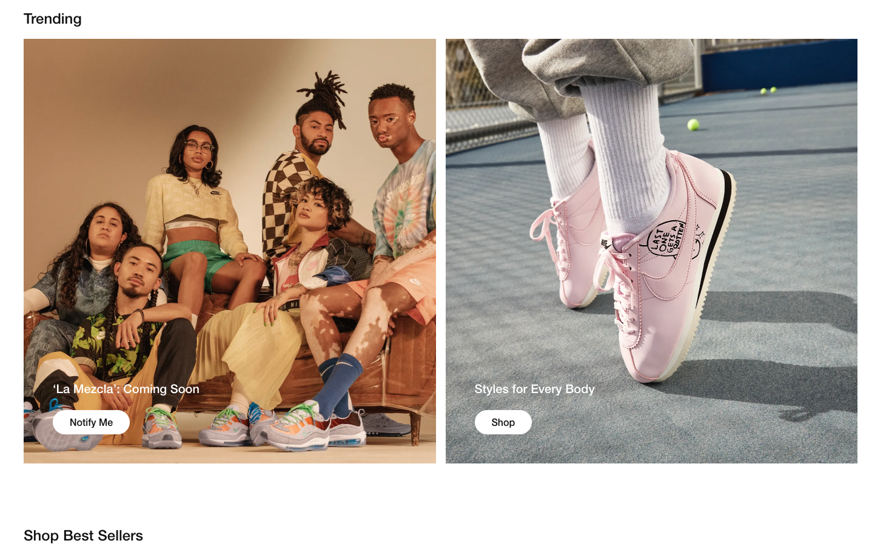
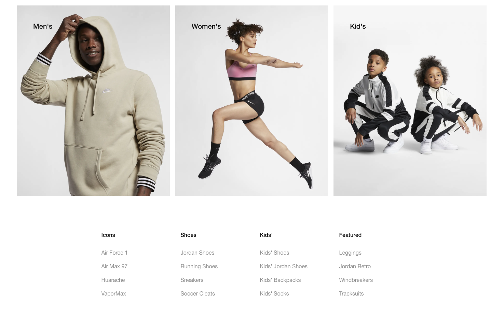
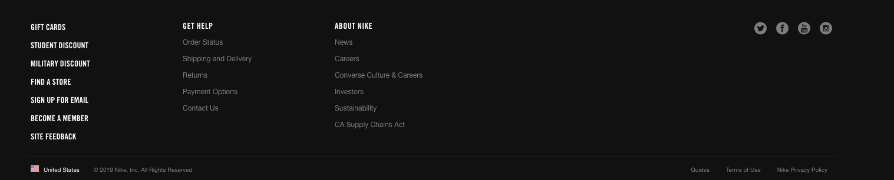

#### Buildout version 1:
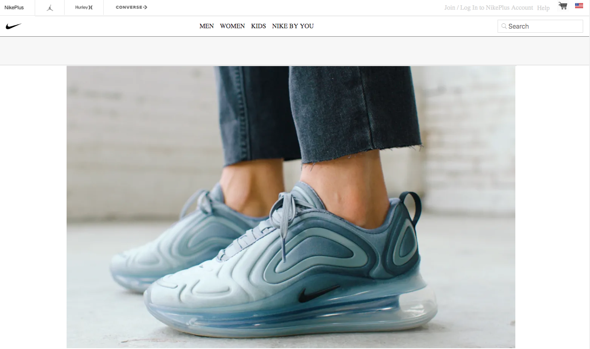
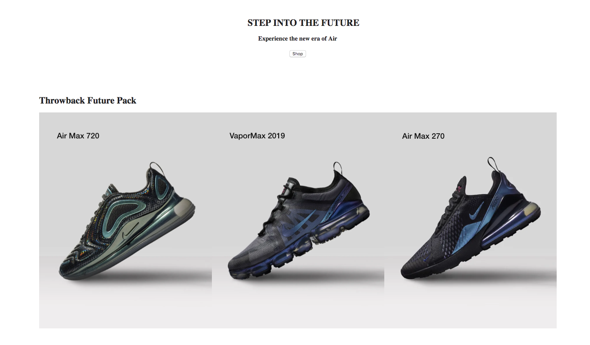
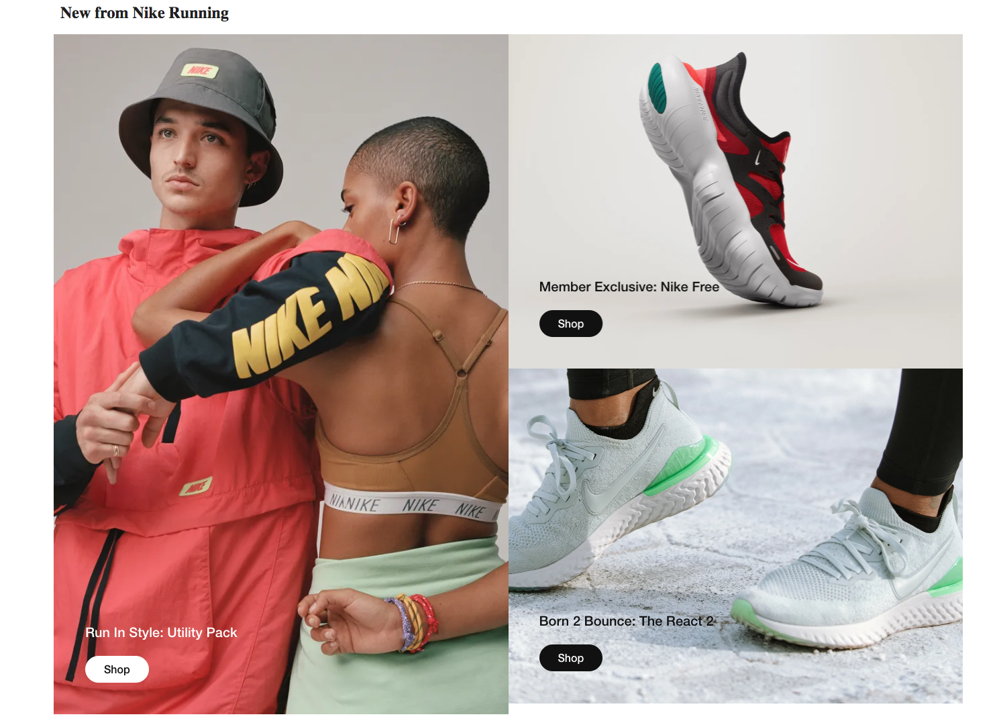
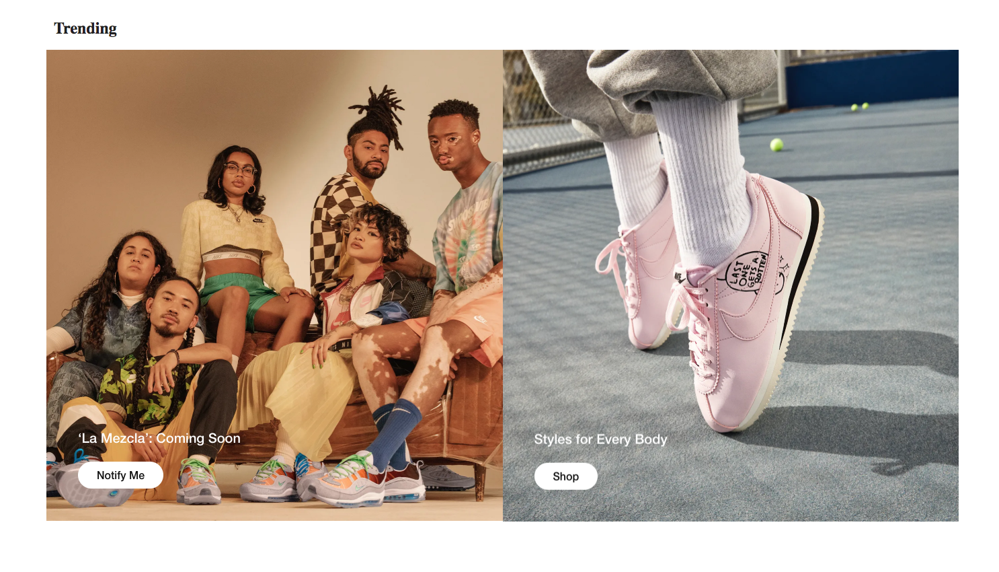

#### Buildout version 2:

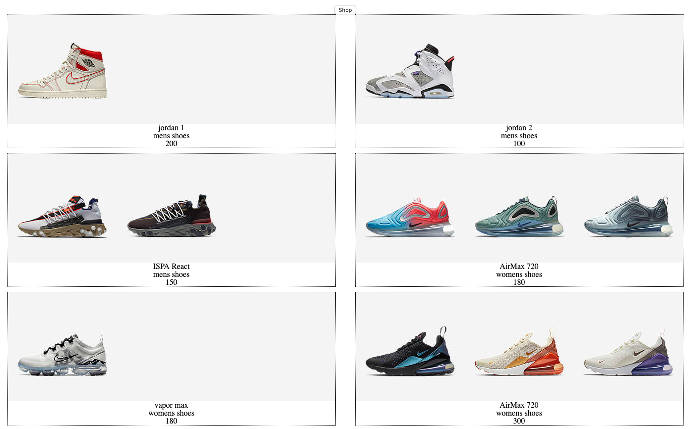

## Known Bugs
_As of April 5th 2019 there are no known bugs_

## List of Technologies Resources
* HTML
* CSS
* Angular
* Typescript

## Further help

To get more help on the Angular CLI use `ng help` or go check out the [Angular CLI README](https://github.com/angular/angular-cli/blob/master/README.md).

#### Developmental Roadmap
* Continue to buildout all maps for mobile / desktop / tablet
* further develop usability
* Implement firebase
* Develop functionality with Log/In along with search function

### License

*{This software is licensed under the MIT license} Copyright (c) 2019 {Robbie Kruszynski}*

Copyright (c) 2019 **_Robbie Kruszynski_**
